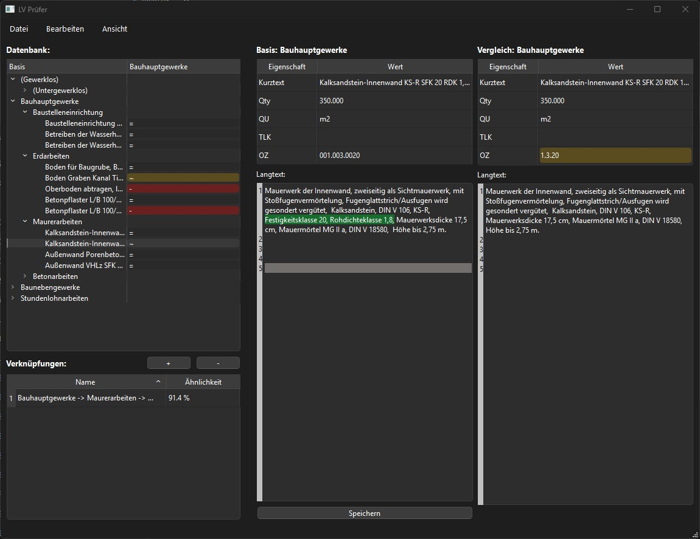

# GAEB Compare
opens GAEB files, finds similaritites and compares them visually

It uses [gaeb-parser](https://github.com/meindonut/gaeb-parser) to import gaeb files. The import process includes a tokenizer [nltk](https://www.nltk.org/index.html) and formatting process to standardize the text and prepare it for comparison. In the import process the positions can be linked to already imported files to compare them later. The comparison between positions is done with [difflibparser](https://github.com/yelsayd/difflibparser) or [diff-match-patch](https://github.com/google/diff-match-patch) The imported positions are handled in an excel database. The UI is designed with [PySide](https://wiki.qt.io/Qt_for_Python). 

## Use it:
download latest zipped release file

## Improve it:

### Install required modules in venv

`python -m venv .venv`

`Set-ExecutionPolicy -ExecutionPolicy Bypass -Scope Process -Force`

`.venv/Scripts/activate.ps1`

`pip install -r requirements.txt`

### run tests

`Set-ExecutionPolicy -ExecutionPolicy Bypass -Scope Process -Force`

`.venv/Scripts/activate.ps1`

`pytest -v -m unit           # unit tests`

`pytest -v -m integration    # integration tests`

### build

`Set-ExecutionPolicy -ExecutionPolicy Bypass -Scope Process -Force`

`.venv/Scripts/activate.ps1`

`pyinstaller --noconsole --clean --name gaeb_compare --add-data "data/german.pickle:data" gaeb_compare/main.py`

### create ui code

`Set-ExecutionPolicy -ExecutionPolicy Bypass -Scope Process -Force`

`.venv/Scripts/activate.ps1`

`pyside6-uic ui/project_window.ui -o gaeb_compare/ui_project_window.py`

## To-Dos
- ...